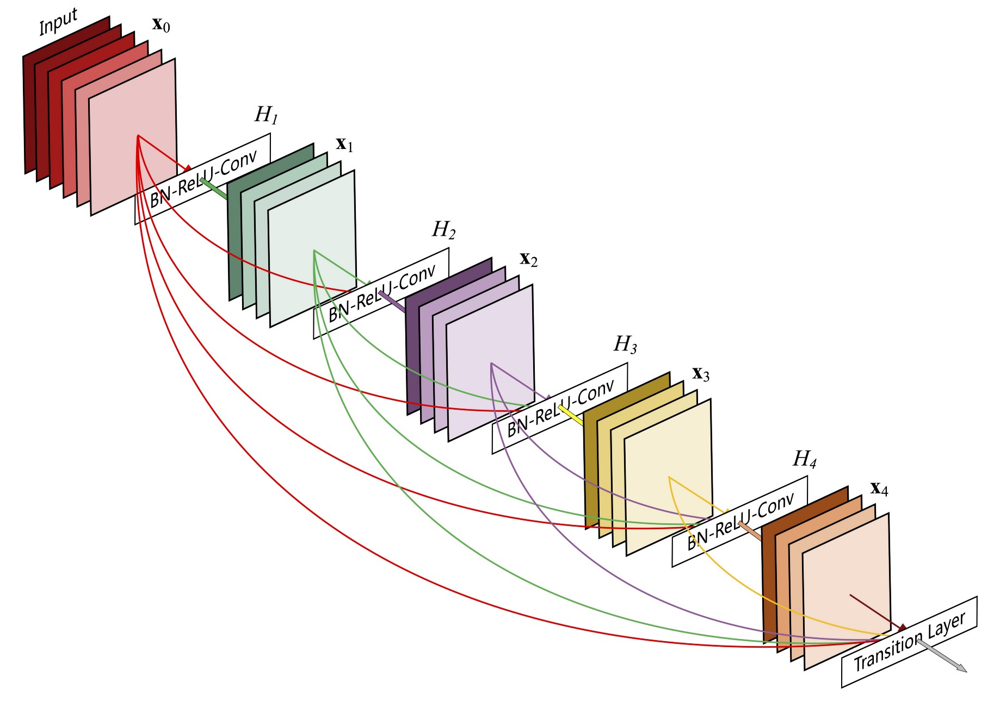
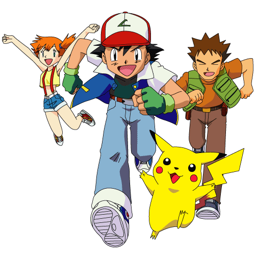

**Before moving on the documentation, check out the app live at [here](https://pokedexgd.herokuapp.com/)**

I have always been an avid Pokemon fan and spent a lot of my time on the FireRed and Emerald games :p

So after learning about Image Classification using CNNs and about Transfer Learning, this idea of making a real-life PokeDex struck my mind.

### Screencast
https://user-images.githubusercontent.com/68523530/133782398-672c750c-7589-4a4e-a769-6ce456a9e6f0.mov

## About the Model
The data for training was collected from [this Kaggle Dataset](https://www.kaggle.com/lantian773030/pokemonclassification) and Tensorflow framework was used for Data Augmentation and Model building. 

The model achieved an accuracy of approximately 87% on the test dataset.

Here is an overview of the DenseNet201 Model:
.
You can read more about the architecture on [this blog](https://towardsdatascience.com/review-densenet-image-classification-b6631a8ef803) and [original paper](https://arxiv.org/pdf/1608.06993).

## About the Application
So after building the model, I wanted to make it to some use for everyone *(and also for some show-off)*. I read about the Streamlit framework that allows you to create beautiful apps for your ML/DL projects. 

After the images are classified according to the saved model, I have used the **[PokeAPI](https://pokeapi.co/)** to fetch details of the Pokemon that include its Type and Description. The sprites have been downloaded from the PokeAPI GitHub Sprites Repo.

Then the model was deployed on Heroku as it is a popular free choice for us students and is reasonably good for the use-case.

### Future additions:
- Add more verbosity to the model.
- ~~Print images of Pokemon in the results.~~
- Work on the theme of the app.

*Feel free to give suggestions or point out flaws in the application. I am only learning and would love to make this better.*

***Don't forget to star the repo and share with your friends if you found this cool!***

